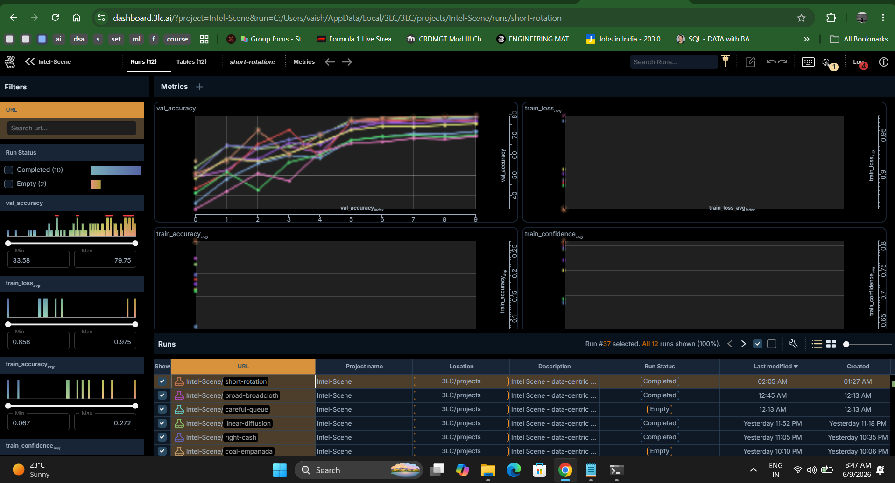

# Intel Scene – 3LC Kaggle Starter Kit

**Data-Centric AI Challenge with 3LC (powered by 3LC)**

> Buildings, forest, glacier, mountain, sea, or street? Build a 6-class scene classifier using data-centric AI with 3LC and compete on the Kaggle leaderboard.

**Setup and workflow:** See the competition **Overview**, **Description**, and **Iterative Workflow** tabs on Kaggle for the full guide. You must also complete the **evaluation & feedback form** by the deadline (see Overview on Kaggle).

---

## Quick start

### 1. Environment

```bash
python -m venv 3lc-env
# Windows: 3lc-env\Scripts\activate
# Mac/Linux: source 3lc-env/bin/activate

# CPU: install 3LC and PyTorch. For GPU: install PyTorch with CUDA first, then 3LC (see Kaggle "Iterative Workflow - Environment Setup").
pip install --index-url https://pypi.3lc.ai/public/repositories/releases-public --extra-index-url https://pypi.org/simple 3lc==2.22.3 joblib pytz umap-learn torch torchvision
```

> **Install the pinned `3lc==2.22.3`** (this kit targets the 3lc 2.x API; the latest 3.x errors on `Int32Value`). Avoid OneDrive-synced folders during setup to prevent file-lock errors.

The starter uses **UMAP** for embedding reduction (3D embeddings in the Dashboard). This works on both CPU and GPU and avoids environment-specific issues that PaCMAP can have (e.g. on some Windows/PyTorch setups). 3LC also supports PaCMAP if you want to switch `method="pacmap"` in `train.py` and install `pacmap`.

### 2. 3LC login

- Create account: [https://account.3lc.ai](https://account.3lc.ai)
- API key: [https://account.3lc.ai/api-key](https://account.3lc.ai/api-key)

```bash
3lc login <your_api_key>
3lc service   # Required to use the 3LC Dashboard (label undefined, view embeddings)
```

### 3. Data

Download `starter_kit.zip` from the competition **Data** tab and extract it once — the pre-split `data/` folder is already inside, next to the scripts (no separate data download, no placement step):

```
data/
├── train/
│   ├── buildings/   (labeled)
│   ├── forest/      (labeled)
│   ├── glacier/     (labeled)
│   ├── mountain/    (labeled)
│   ├── sea/         (labeled)
│   ├── street/      (labeled)
│   └── undefined/   (unlabeled — use 3LC to label and add to training)
├── val/
│   ├── buildings/
│   ├── forest/
│   ├── glacier/
│   ├── mountain/
│   ├── sea/
│   └── street/
└── test/            (flat — only images, no subfolders; for submission)
```

**No test data is used during training.** Only `train` and `val` are registered in 3LC; `predict.py` reads `data/test/` only for inference.

### 4. Run order (train and submit)

```bash
python register_tables.py   # once — create 3LC tables from data/train, data/val
python train.py             # train model; writes best_model.pth
python predict.py           # run inference; writes submission.csv
```

Upload `submission.csv` to the Kaggle competition.

---

## Competition at a glance

| Item | Details |
|------|--------|
| **Task** | 6-class scene classification: buildings (0), forest (1), glacier (2), mountain (3), sea (4), street (5) |
| **Model** | ResNet-18 (fixed); no pretrained weights — train from scratch |
| **Metric** | Accuracy on hidden test set |
| **Tool** | 3LC (required) |
| **Labeling budget** | Final train table may contain at most **3,000 rows with weight = 1** |

---

## Data-centric loop

1. **Train** – `train.py` → 3LC run with embeddings.
2. **Analyze** – Dashboard: embeddings, per-sample metrics.
3. **Fix data** – Label `undefined`, correct labels, adjust weights.
4. **Retrain** – `train.py` uses `.latest()` tables.
5. **Submit** – `predict.py` → `submission.csv` → Kaggle.

---

## Data at a glance (no ambiguity)

| Set | Labeled | Unlabeled | Total |
|-----|---------|-----------|-------|
| **Train** | 600 (100 per class, balanced) | 6,000 undefined | 6,600 |
| **Val** | 1,200 (200 per class, balanced) | 0 | 1,200 |
| **Test** | Hidden | — | 1,800 |

You start with **600 labeled** and **6,000 unlabeled**. Val is 1,200 (200 per class) for stable feedback. Use 3LC to label undefined samples and retrain to improve accuracy.

**Labeling budget rule:** your final train table may have at most **3,000 rows with weight = 1** (the 600 seed rows count toward this). Choose which pool samples to label strategically — you cannot simply enable everything.

`train.py` enforces this cap: it counts the weight-1 rows in the loaded train table before training, prints the running total, and refuses to train (clear error, non-zero exit, no 3LC run created) if the table exceeds 3,000.

### Classes

| Label | Class |
|-------|-----------|
| 0 | buildings |
| 1 | forest |
| 2 | glacier |
| 3 | mountain |
| 4 | sea |
| 5 | street |

## Outputs (what each script produces)

| Script | Output | Behavior when run again |
|--------|--------|--------------------------|
| `register_tables.py` | 3LC tables (train, val) | **Idempotent:** if tables already exist, skips and does not overwrite; safe to run multiple times |
| `train.py` | `best_model.pth` | **Overwrites** previous best model |
| `predict.py` | `submission.csv` + timestamped copy in `submissions/` | **Overwrites** `submission.csv`; also saves `submissions/submission_YYYYMMDD_HHMMSS.csv`, so previous submissions are preserved |

So: each training run replaces `best_model.pth`; each prediction run replaces `submission.csv` (but keeps a timestamped copy in `submissions/`). For a different checkpoint, rename or copy `best_model.pth` before running `train.py` again.

---

## Loading tables: .latest() vs URL

- **Default:** `train.py` loads tables by **name** with **`.latest()`**, so it always uses the newest revision (including any edits you make in the 3LC Dashboard).
- **Optional:** To train on a **specific** table revision, you can load by URL. In `train.py`, comment out the "OPTION 1" block and uncomment the "OPTION 2" block, then paste your train and val table URLs (from the 3LC Dashboard → Tables tab → copy URL).

---

## Files in this kit

| File | Purpose |
|------|--------|
| `config.yaml` | Competition and training config |
| `register_tables.py` | Register train/val in 3LC (run once) |
| `train.py` | Training with 3LC; saves `best_model.pth` |
| `predict.py` | Inference on test; writes `submission.csv` |
| `sample_submission.csv` | Required submission format and image_ids |
| `data/` | Pre-split train, val, and test images |
| `README.md` | This file |

---

## Submission format

`submission.csv` must have:

- `image_id` – same IDs as in `sample_submission.csv` (test_00001 … test_01800)
- `prediction` – integer 0–5 (0=buildings, 1=forest, 2=glacier, 3=mountain, 4=sea, 5=street)
- `confidence` – float in [0, 1]

---

## Dataset and pipeline verification

- **Splits:** Only `data/train` and `data/val` are registered in 3LC. **Test data is never used for training.** `predict.py` reads only `data/test/` for inference.
- **Train/val:** Train has labeled (buildings, forest, glacier, mountain, sea, street) and undefined (weight=0 until you label in Dashboard). Val has only labeled classes. Class distributions can be checked in the 3LC Dashboard after running `register_tables.py`.
- **Reproducibility:** `train.py` sets a fixed random seed (see `RANDOM_SEED` in the script) so training is deterministic for the same data and code.
- **Submission alignment:** If `sample_submission.csv` is present, `predict.py` writes a submission with the same `image_id`s in the same order; missing test images get a default prediction so the file is valid for Kaggle.

---

## For reviewers and live demo

- **Run order:** `register_tables.py` (once) → `train.py` → `predict.py`. No silent dependencies on uncommitted or external state.
- **Failures are explicit:** Missing model, missing test dir, empty test folder, or invalid model file all print a clear error and exit with non-zero status.
- **Overwrite behavior:** Each run of `train.py` overwrites `best_model.pth`; each run of `predict.py` overwrites `submission.csv`. No versioning; documented in README and in script docstrings.
- **Table loading:** Participants see which tables are used: `train.py` prints train and val table URLs after loading. Optional URL-based loading is available (commented out) for pinning to a specific revision.

---

## Resources

- [3LC Documentation](https://docs.3lc.ai)

## Our Implementation

This project implements a data-centric image classification workflow for the Intel Scene dataset using **3LC** and **ResNet-18**.

### Project Approach

The six scene categories used for classification are:

* Buildings
* Forest
* Glacier
* Mountain
* Sea
* Street

The project uses **ResNet-18 trained from scratch**, with 3LC used to inspect and improve the training data through sample-level analysis.

The workflow followed was:

**Dataset → 3LC Table → Data Inspection → Sample Selection/Weighting → ResNet-18 Training → Per-Sample Metrics → Error Analysis → Embedding Analysis → Final Evaluation**

### Data-Centric Analysis

3LC was used to inspect individual training samples using:

* Loss
* Prediction accuracy
* Prediction confidence
* Sample weight
* Embeddings

This allowed potentially difficult or incorrectly predicted samples to be identified and analyzed instead of relying only on overall validation accuracy.

### Final Training

The final experiment was selected after comparing the training runs and inspecting the data through the 3LC Dashboard.

**Final validation accuracy: 77.77%**

The final model and training configuration were retained for the project submission.

### Screenshots

#### 3LC Training Dashboard



#### Final Training Table


#### Metrics / Model Analysis


### Key Outcome

The project demonstrates how a data-centric workflow can complement model training by providing visibility into individual samples, their predictions, confidence, and learned representations.

Rather than treating the dataset as fixed, the workflow uses **3LC to inspect, analyze, and iteratively improve the data used by the classifier**.


Good luck, and may the best data win.
